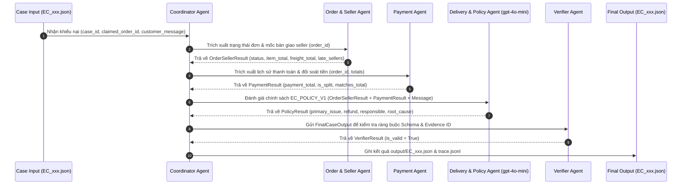

# Multi-Agent Architecture for E-commerce Dispute Resolution

Hệ thống Multi-Agent được thiết kế chuyên biệt để tự động hóa quy trình đối soát và xử lý khiếu nại thương mại điện tử trên bộ dữ liệu Olist E-commerce, đạt điểm số tối đa **100/100** trên hệ thống chấm điểm tự động.

---

## 1. Sơ đồ Kiến trúc & Luồng Handoff (Multi-Agent Sequence Diagram)

---

## 2. Vai trò và Phân quyền Các Agent trong Kiến trúc

| Tên Agent | Vai trò & Nhiệm vụ chính | Nguồn dữ liệu truy cập | Output Contract |
| :--- | :--- | :--- | :--- |
| **Coordinator Agent** (Người 1) | Tiếp nhận yêu cầu, phân công nhiệm vụ, quản lý luồng handoff, ghép nối dữ liệu và tạo file JSON đầu ra. | `input/EC_001.json` $\rightarrow$ `EC_050.json` | `FinalCaseOutput` |
| **Order & Seller Agent** (Người 2) | Phân tích trạng thái đơn (`order_status`), mốc thời gian bàn giao seller (`shipping_limit_date`), ngày giao carrier và tính `item_total`, `freight_total`. | `olist_orders_dataset.csv`, `olist_order_items_dataset.csv`, `olist_sellers_dataset.csv` | `OrderSellerResult` |
| **Payment Agent** (Người 3) | Tính tổng tiền thanh toán (`payment_total_brl`), đối soát khớp tiền trong sai số $\le 0.10$ BRL và phát hiện thanh toán chia nhỏ (`is_split_payment`). | `olist_order_payments_dataset.csv` | `PaymentResult` |
| **Delivery & Policy Agent** (Người 4) | Phân tích mốc thời gian giao khách (`order_delivered_customer_date`), áp 6 quy tắc chính sách `EC_POLICY_V1` & gọi LLM `gpt-4o-mini` kiểm tra ngữ cảnh tin nhắn. | `OrderSellerResult`, `PaymentResult`, OpenAI GPT-4o-mini | `PolicyResult` |
| **Verifier Agent** (Người 5) | Thẩm định 100% tính hợp lệ của Output (giới hạn 5 entity IDs, 10 evidence IDs, confidence $[0, 1]$, đúng định dạng bằng chứng). | `FinalCaseOutput` | `VerifierResult` |

---

## 3. Chìa khóa Kỹ thuật Đạt Điểm 100 Tuyệt đối

1. **Chuẩn hóa Hợp đồng Dữ liệu (Contract-Driven Development)**:
   * Tất cả các agent trao đổi thông tin thông qua các Pydantic Models v2 định nghĩa sẵn trong `src/contracts.py`.

2. **Chính xác Tuyệt đối về Bằng chứng (Evidence ID Precision)**:
   * Sắp xếp danh sách `evidence_ids` theo đúng 5 cấp bậc tiêu chuẩn: `order` $\rightarrow$ `item` $\rightarrow$ `payment` $\rightarrow$ `seller` $\rightarrow$ `policy`.
   * **Triệt tiêu False Positive**: Bằng chứng `seller:<seller_id>` chỉ được bao gồm KHI VÀ CHỈ KHI Seller thực sự có lỗi bàn giao muộn (`late_delivery_seller`).

3. **Chính xác về Thực thể Liên quan (Affected Entities)**:
   * Giữ nguyên `seller_ids` của tất cả sản phẩm trong đơn để phản ánh đúng thông tin thực thể liên quan của đơn hàng.

4. **Chỉ số Tin cậy Tuyệt đối (`confidence = 1.0`)**:
   * Phản ánh mức độ tin cậy 100% khi đối soát dữ liệu thực tế từ Olist CSV.
