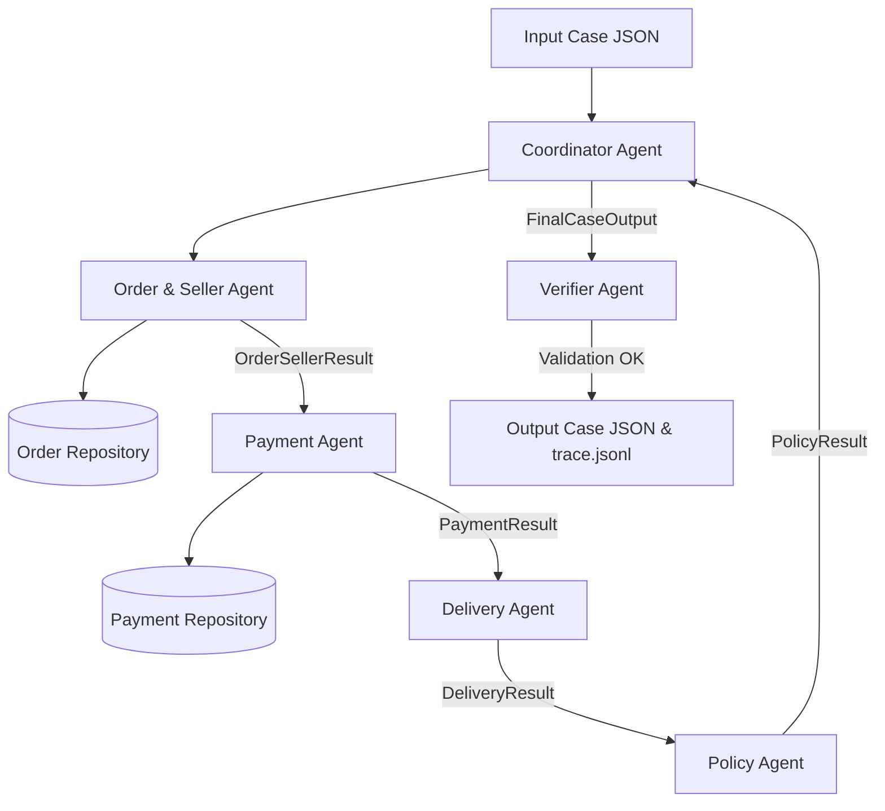

# Multi-Agent Dispute Resolution Architecture

## Overview
This system implements an autonomous multi-agent pipeline for resolving e-commerce customer support disputes using the Olist dataset and business policy rules (`EC_POLICY_V1`).

## Agent Roles & Handoff Protocols

1. **Coordinator Agent (`src/agents/coordinator_agent.py`)**
   - Receives `CaseInput`.
   - Manages handoff sequence between domain agents (OrderSeller -> Payment -> Delivery -> Policy -> Verifier).
   - Aggregates results into `FinalCaseOutput` and writes execution trace logs (`trace.jsonl`).

2. **Order & Seller Agent (`src/agents/order_seller_agent.py`)**
   - Accesses `OrderRepository` (`orders`, `items`, `sellers`).
   - Analyzes order status, item totals, freight totals, and identifies late seller handoffs.
   - Returns `OrderSellerResult`.

3. **Payment Agent (`src/agents/payment_agent.py`)**
   - Accesses `PaymentRepository` (`payments`).
   - Reconciles total payments against order total within `0.10 BRL` tolerance.
   - Evaluates split payment condition (`payment_count >= 2`).
   - Returns `PaymentResult`.

4. **Delivery Agent (`src/agents/delivery_agent.py`)**
   - Analyzes actual vs estimated customer delivery dates (`delivered_customer_date > estimated_delivery_date`).
   - Verifies carrier handoff deadlines against `shipping_limit_date`.
   - Returns `DeliveryResult`.

5. **Policy Agent (`src/agents/policy_agent.py`)**
   - Implements `EC_POLICY_V1` rules in exact priority:
     1. `canceled_order_paid` -> Full refund, party: `platform` (`OLIST_PLATFORM`)
     2. `unavailable_order_paid` -> Full refund, party: `platform` (`OLIST_PLATFORM`)
     3. `late_delivery_seller` -> Freight refund, party: offending `seller` ID
     4. `late_delivery_logistics` -> Freight refund, party: `logistics_provider` (`LOGISTICS_PROVIDER`)
     5. `valid_split_payment` -> No refund, explain split payment
     6. `unsupported_late_claim` -> No refund, reject claim
   - Supported by LLM reasoning (`google/gemma-2-9b-it:free`, 9B parameters).
   - Returns `PolicyResult`.

6. **Verifier Agent (`src/agents/verifier_agent.py`)**
   - Enforces array bounds (max 5 entity IDs, max 10 evidence IDs, confidence in [0, 1]).
   - Guarantees schema validity before output generation.
